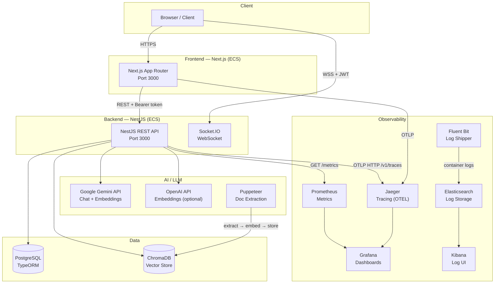
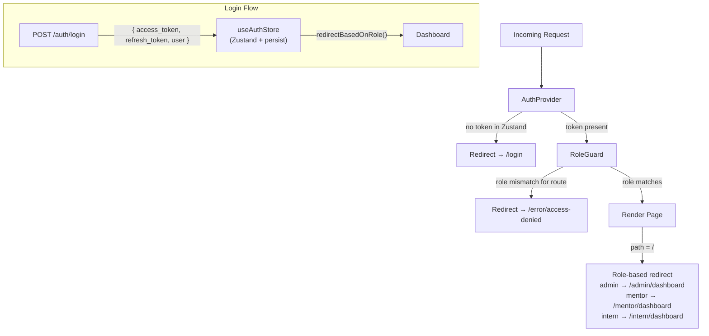
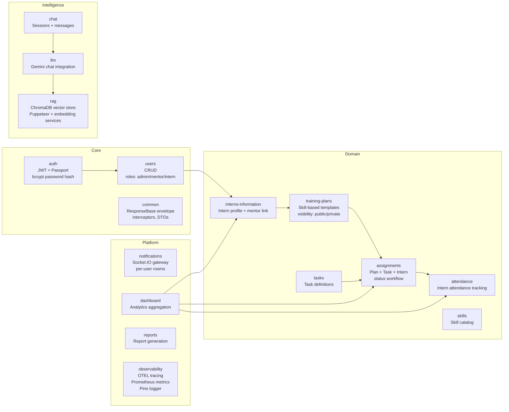
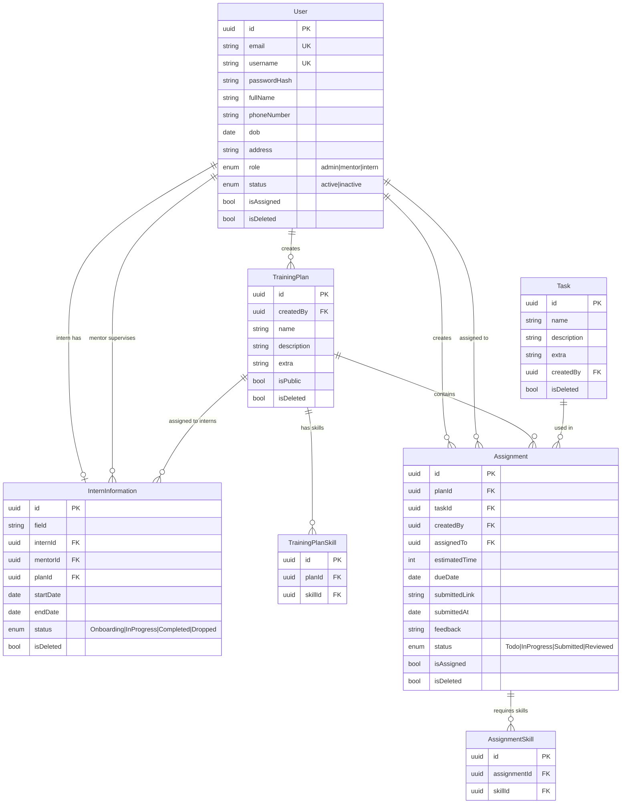
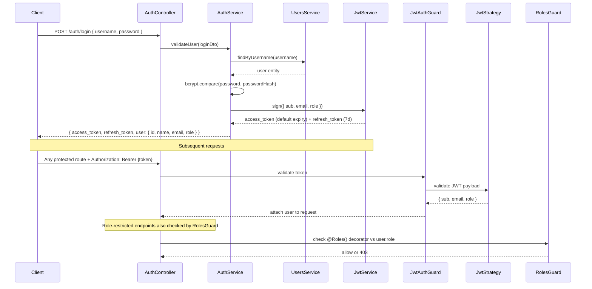
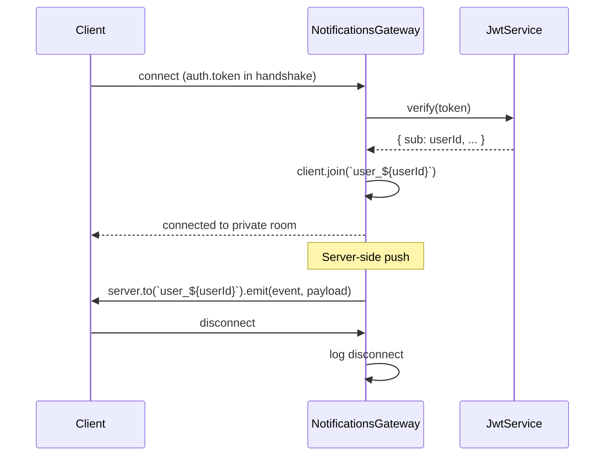
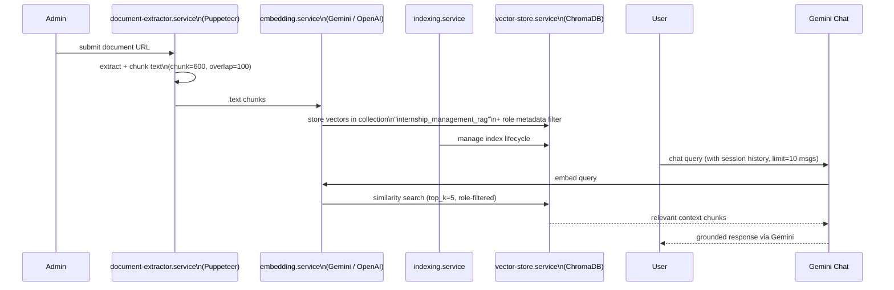
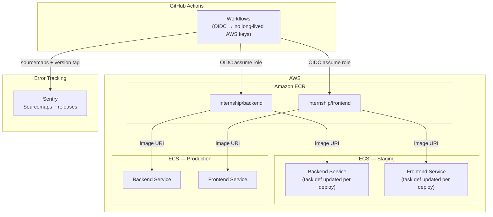
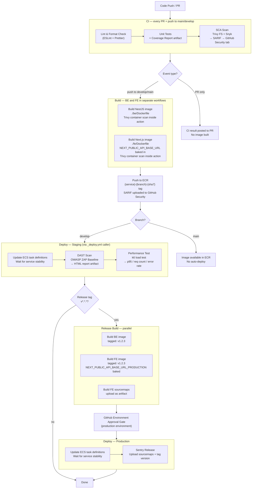
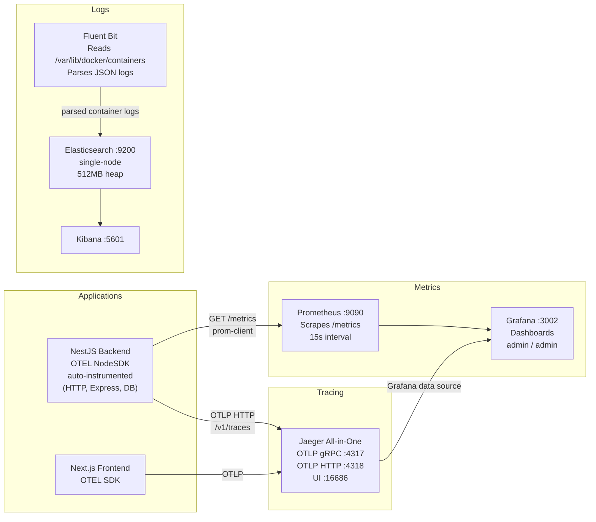

# Architecture

Full-stack internship management platform. NestJS backend + Next.js frontend deployed on AWS ECS via GitHub Actions DevSecOps pipeline.

---

## Table of Contents

1. [System Overview](#1-system-overview)
2. [Frontend Architecture](#2-frontend-architecture)
   - [Route Structure](#route-structure)
   - [Auth & Access Control](#auth--access-control-flow)
   - [State Management](#state-management)
   - [Service Layer](#service-layer)
3. [Backend Architecture](#3-backend-architecture)
   - [Module Map](#module-map)
   - [Data Model](#data-model)
   - [Auth Flow](#auth-flow)
   - [WebSocket Gateway](#websocket-gateway)
   - [RAG Pipeline](#rag-pipeline)
   - [Observability Instrumentation](#observability-instrumentation)
4. [Infrastructure & Multi-Environment](#4-infrastructure--multi-environment)
5. [DevSecOps Pipeline](#5-devsecops-pipeline)
   - [Security Gates](#security-gates)
   - [Performance Testing](#performance-testing)
   - [Dependency Management](#dependency-management)
6. [Observability Stack](#6-observability-stack)

---

## 1. System Overview



---

## 2. Frontend Architecture

**Stack:** Next.js 14+ App Router · TypeScript strict · TailwindCSS · Radix UI · Framer Motion · Zustand · SWR · Socket.IO client

### Route Structure

```
src/app/
├── (auth)/
│   └── login/                        # Public — no auth required
├── (protected)/
│   ├── layout.tsx                    # AuthProvider + RoleGuard wrapper
│   ├── profile/                      # All roles: personal profile
│   ├── (admin-only)/
│   │   └── admin/
│   │       ├── dashboard/            # Platform analytics
│   │       ├── users/                # User CRUD (all roles)
│   │       ├── interns/              # Intern oversight
│   │       ├── mentors/              # Mentor management
│   │       ├── attendance/           # Attendance admin view
│   │       └── reports/              # Admin reports
│   ├── (mentor-only)/
│   │   └── mentor/
│   │       ├── dashboard/            # Mentor overview
│   │       ├── attendance/           # Mark/view attendance
│   │       └── reports/              # Intern progress reports
│   ├── (intern-only)/
│   │   └── intern/
│   │       ├── dashboard/            # Personal progress
│   │       └── attendance/           # Personal attendance
│   └── (shared)/                     # All authenticated roles
│       ├── assignments/              # Task assignments
│       ├── chat/                     # AI chat (RAG-backed)
│       ├── skills/                   # Skill catalog
│       ├── tasks/                    # Task definitions
│       └── training-plans/           # Training plan browser
├── api/                              # Next.js API routes (proxy / BFF)
├── error/access-denied/
└── export/                           # PDF / report export
```

### Auth & Access Control Flow



### State Management

All stores live in `src/store/` using Zustand. `useAuthStore` uses `persist` middleware (localStorage).

| Store | State | Purpose |
|---|---|---|
| `useAuthStore` | `userDetails`, `accessToken`, `refreshToken`, `isAuthenticated`, `isHydrated` | JWT tokens, login/logout, role-based redirect |
| `useLoadingStore` | `isLoading` | Global loading spinner |
| `useToastStore` | `toasts[]` | Toast notification queue |
| `useNotificationStore` | `notifications[]` | Real-time Socket.IO notifications |
| `useSidebarStore` | `isOpen` | Sidebar collapsed/expanded |

### Service Layer

All services in `src/services/` send `Authorization: Bearer {token}` from `useAuthStore`. Pattern: async functions wrapping `fetch` against `API_URL` constant.

| Service | Backing API Module |
|---|---|
| `auth.services.ts` | `POST /auth/login`, `/auth/refresh`, `/auth/logout` |
| `user.services.ts` | `GET/POST/PATCH/DELETE /users` |
| `intern.services.ts` | `GET/POST /interns-information` |
| `assignment.services.ts` | `GET/POST/PATCH /assignments` |
| `task.services.ts` | `GET/POST/PATCH /tasks` |
| `trainingPlan.services.ts` | `GET/POST/PATCH /training-plans` |
| `attendance.services.ts` | `GET/POST /attendance` |
| `chat.services.ts` | `GET/POST /chat` |
| `skill.services.ts` | `GET/POST /skills` |
| `dashboard.services.ts` | `GET /dashboard` |
| `reports.services.ts` | `GET /reports` |
| `notification.services.ts` | Socket.IO connection + event handlers |

---

## 3. Backend Architecture

**Stack:** NestJS · TypeScript strict · TypeORM · PostgreSQL · Passport JWT · Socket.IO · ChromaDB · Gemini API · OpenTelemetry

### Module Map



### Data Model



### Auth Flow



**Guards & Decorators:**

| File | Purpose |
|---|---|
| `guards/jwt-auth.guard.ts` | Validates Bearer JWT on all protected routes |
| `guards/roles.guard.ts` | Enforces `@Roles('admin', 'mentor')` decorator |
| `strategies/jwt.strategy.ts` | Passport JWT strategy — extracts payload |
| `decorators/roles.decorator.ts` | `@Roles(...roles)` metadata setter |
| `decorators/user.decorator.ts` | `@CurrentUser()` param decorator — injects user from request |

### WebSocket Gateway

`notifications.gateway.ts` — Socket.IO gateway with JWT auth on connection.



- Each user joins room `user_{userId}` on connect
- Clients without valid JWT are immediately disconnected
- Server pushes notifications via `server.to(room).emit()`
- CORS: `localhost:3000` + Vercel deployment URL

### RAG Pipeline



**RAG constants** (`rag.constants.ts`):

| Constant | Value | Purpose |
|---|---|---|
| `RAG_COLLECTION_NAME` | `internship_management_rag` | ChromaDB collection |
| `RAG_CHUNK_SIZE` | `600` | Chars per document chunk |
| `RAG_CHUNK_OVERLAP` | `100` | Overlap between chunks |
| `RAG_TOP_K` | `5` | Retrieved chunks per query |
| `RAG_MEMORY_MESSAGE_LIMIT` | `10` | Chat history messages kept |

### Observability Instrumentation

**Tracing** (`observability/tracing.ts`):
- OpenTelemetry NodeSDK with `getNodeAutoInstrumentations()` — auto-instruments HTTP, Express, DB calls
- Exporter: OTLP HTTP → `OTEL_EXPORTER_OTLP_ENDPOINT/v1/traces` (default: `http://localhost:4318`)
- Service name: `OTEL_SERVICE_NAME` env (default: `internship-management-be`)
- Disabled via `OTEL_ENABLED=false`

**Metrics** (`observability/metrics.ts`):
- Prometheus `prom-client` with default system metrics (`internship_management_` prefix)
- Custom histogram: `internship_management_http_request_duration_seconds` — labels: `method`, `route`, `status_code`
- Buckets: `[0.005, 0.01, 0.05, 0.1, 0.3, 1, 2, 5]` seconds
- Exposed at `GET /metrics`

**Logging** (`observability/pino-logger.config.ts`):
- Pino structured JSON logging
- Collected by Fluent Bit from Docker container stdout → Elasticsearch

---

## 4. Infrastructure & Multi-Environment

### AWS Architecture



### Environment Matrix

| Environment | Trigger | Approval Gate | Auto-deploy |
|---|---|---|---|
| **HUB** (build) | Push to `main`/`develop`, PR | — | — |
| **Staging** | `workflow_dispatch` or called via `_deploy.yml` | None | Manual / caller-triggered |
| **Production** | Tag `v*.*.*` | GitHub Environment approval | After approval |

> **Note:** `_deploy.yml` is a reusable workflow ready for staging auto-deploy. Wire a `deploy-staging.yml` caller to trigger it automatically on `develop` pushes.

### Image Tagging Strategy

| Event | Tag Format | Example |
|---|---|---|
| Pull Request | `be-pr-{number}-{sha7}` | `be-pr-42-a1b2c3d` |
| Branch push | `be-{branch}-{sha7}` | `be-develop-a1b2c3d` |
| Release tag | `{v1.2.3}` | `v1.2.3` |

### Required Secrets & Variables

| Secret | Scope | Purpose |
|---|---|---|
| `SNYK_TOKEN` | CI | Snyk SCA scan |
| `AWS_OIDC_ROLE` (var) | Build | OIDC role for ECR push |
| `AWS_OIDC_ROLE_STAGING` (var) | Deploy staging | OIDC role for ECS staging |
| `AWS_OIDC_ROLE_PRODUCTION` (var) | Deploy prod | OIDC role for ECS production |
| `SENTRY_AUTH_TOKEN` | Release | Sentry sourcemap upload |

| Variable | Purpose |
|---|---|
| `ECS_CLUSTER_STAGING/PRODUCTION` | ECS cluster name per env |
| `ECS_BACKEND_SERVICE_STAGING/PRODUCTION` | ECS service name |
| `ECS_FRONTEND_SERVICE_STAGING/PRODUCTION` | ECS service name |
| `ECS_BACKEND_TASKDEF_STAGING/PRODUCTION` | Task definition family |
| `ECS_FRONTEND_TASKDEF_STAGING/PRODUCTION` | Task definition family |
| `NEXT_PUBLIC_API_BASE_URL_STAGING/PRODUCTION` | Baked into FE bundle at build time |
| `SENTRY_ORG` / `SENTRY_PROJECT` | Sentry release metadata |

### OIDC Security (GitHub Actions -> AWS)

The platform uses GitHub OIDC federation (`token.actions.githubusercontent.com`) so workflows get short-lived AWS credentials at runtime instead of storing long-lived AWS access keys in GitHub secrets.

**Security properties**
- No static AWS key material in repository settings or CI variables
- Temporary STS credentials are issued only after OIDC token validation
- Blast radius is limited by role scope + session lifetime
- Role assumption can be bound to exact repositories, branches, tags, and environments

**Trust flow**
1. GitHub Actions job requests an OIDC ID token (`id-token: write` permission required).
2. AWS IAM verifies token signature, issuer, audience, and token claims.
3. If IAM trust policy conditions pass, `AssumeRoleWithWebIdentity` returns short-lived credentials.
4. Workflow uses temporary credentials for ECR push / ECS deploy, then credentials expire automatically.

**Recommended IAM trust policy constraints**
- `aud` must equal `sts.amazonaws.com`
- `iss` must equal `https://token.actions.githubusercontent.com`
- `sub` must be restricted to approved refs only, for example:
  - `repo:<org>/<repo>:ref:refs/heads/develop` for staging deploy
  - `repo:<org>/<repo>:ref:refs/tags/v*` for production deploy
- Prefer separate IAM roles per environment (`build`, `staging`, `production`) with least privilege

**Hardening controls**
- Grant only required GitHub workflow permissions; avoid broad defaults
- Protect production deployment with GitHub Environment approval gates
- Enforce branch protection + required status checks before merge
- Keep session duration minimal (for example 15-60 minutes)
- Enable CloudTrail + GuardDuty to monitor anomalous `AssumeRoleWithWebIdentity` usage
- Add explicit deny statements where possible (cross-account, wildcard resources)

**Operational checks**
- Validate role assumption source with CloudTrail `userIdentity.webIdFederationData`
- Alert on OIDC role usage outside expected repositories or refs
- Rotate IAM policies when pipeline scope changes (new services/resources)
- Periodically test break-glass paths and failed-assume scenarios

---

## 5. DevSecOps Pipeline

### Full Pipeline Flow



### Security Gates

| Gate | Tool | Stage | Output |
|---|---|---|---|
| Dependency vulnerabilities (FS) | Trivy FS scan | CI — every PR + push | SARIF → GitHub Security tab |
| Dependency vulnerabilities (SCA) | Snyk | CI — every PR + push | Inline report (continue-on-error) |
| Container image vulnerabilities | Trivy image scan | Build — inside `build-push-ecr` | SARIF → GitHub Security tab |
| Runtime DAST | OWASP ZAP Baseline | Post-deploy staging | HTML report artifact (7d retention) |
| Secret scanning | GitHub native | Repository-level | GitHub blocks push |
| Dependency updates | Dependabot | Weekly Monday 09:00 ICT | PRs to `develop` |

> Trivy scans severity: `CRITICAL,HIGH`. All findings visible in GitHub → Security → Code scanning.

### Performance Testing

k6 runs automatically after every staging deploy via `_deploy.yml`.

```
fe/k6/load-test.js         ← test script
TARGET_URL                 ← staging app URL
K6_CLOUD_TOKEN             ← optional: upload to Grafana Cloud k6
```

**Metrics reported in GitHub Step Summary:**

| Metric | Description |
|---|---|
| `p95 latency` | 95th percentile HTTP response time (ms) |
| `Total requests` | Total requests fired during test |
| `Error rate` | Percentage of failed requests (%) |

Results artifacts: `k6-results.json` + `k6-summary.json` (7d retention).

### Dependency Management

Dependabot runs **every Monday 09:00 ICT**, targets `develop` branch.

| Ecosystem | Directory | Grouping | PR limit |
|---|---|---|---|
| npm | `/be` | All minor + patch grouped as `backend-non-major` | 5 |
| npm | `/fe` | All minor + patch grouped as `frontend-non-major` | 5 |
| github-actions | `/` | Individual (no grouping) | 3 |

Major version bumps always get individual PRs regardless of grouping.

---

## 6. Observability Stack

### Signal Architecture



### Stack Components

| Component | Image | Port(s) | Purpose |
|---|---|---|---|
| Jaeger | `jaegertracing/all-in-one:1.59` | 16686 (UI), 4317 (gRPC), 4318 (HTTP) | Distributed tracing |
| Prometheus | `prom/prometheus:v2.55.1` | 9090 | Metrics scraping + storage |
| Grafana | `grafana/grafana:11.2.0` | 3002 | Unified dashboards (metrics + traces) |
| Elasticsearch | `elasticsearch:8.15.0` | 9200 | Log storage and indexing (security off) |
| Kibana | `kibana:8.15.0` | 5601 | Log search and visualization |
| Fluent Bit | `fluent/fluent-bit:3.1.9` | — | Collect + parse Docker container logs |

### Backend Metrics Exposed

Custom Prometheus metrics (`internship_management_` prefix):

| Metric | Type | Labels | Description |
|---|---|---|---|
| `internship_management_http_request_duration_seconds` | Histogram | `method`, `route`, `status_code` | HTTP request latency |
| Default Node.js metrics | Various | — | CPU, memory, event loop, GC |

Histogram buckets: `0.005s, 0.01s, 0.05s, 0.1s, 0.3s, 1s, 2s, 5s`

### Environment Variables for Observability

| Variable | Default | Purpose |
|---|---|---|
| `OTEL_ENABLED` | `true` | Set `false` to disable tracing |
| `OTEL_SERVICE_NAME` | `internship-management-be` | Service name in traces |
| `OTEL_EXPORTER_OTLP_ENDPOINT` | `http://localhost:4318` | OTLP collector base URL |
| `OTEL_EXPORTER_OTLP_TRACES_ENDPOINT` | derived from above | Override traces endpoint only |

### Local Development

Start full stack with observability:

```bash
docker compose up -d
```

| UI | URL | Credentials |
|---|---|---|
| Application frontend | http://localhost:3000 | — |
| Backend API + Swagger | http://localhost:3001/api/docs | — |
| Jaeger traces | http://localhost:16686 | — |
| Prometheus | http://localhost:9090 | — |
| Grafana | http://localhost:3002 | admin / admin |
| Kibana logs | http://localhost:5601 | — |
