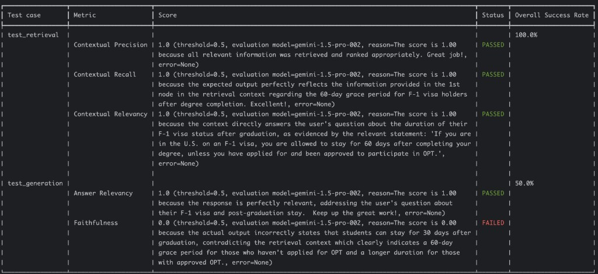
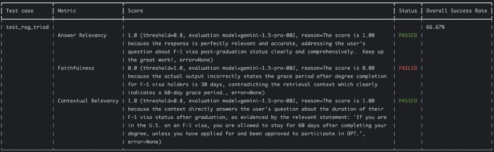
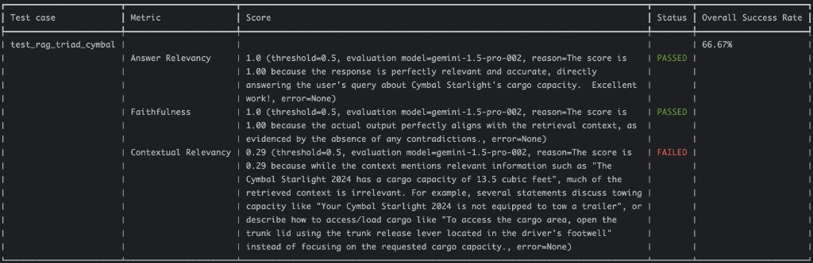

# RAG Evaluation — Bilingual Articles / Bài viết song ngữ

---

# 🇬🇧 ENGLISH VERSION

---

# Article 1: Evaluating RAG Pipelines

*Posted on January 9, 2025*

Retrieval-Augmented Generation (RAG) emerged as a dominant framework to feed LLMs the context beyond the scope of its training data and enable LLMs to respond with more grounded answers with less hallucinations based on that context.

However, designing an effective RAG pipeline can be challenging. You need to answer certain questions such as:

- How should you parse and chunk text documents for embedding? What chunk and overlay size to use?
- What embedding model is best for your use case?
- What retrieval method works most effectively? How many documents should you retrieve by default? Does the retriever actually manage to retrieve the relevant documents?
- Does the generator actually generate content in line with the relevant context? What parameters (e.g. model, prompt template, temperature) work better?

The only way to objectively answer these questions is to measure how well the RAG pipeline works — but what exactly do you measure? This is the topic of this blog post.

## Typical RAG Pipeline

A typical RAG pipeline is made up of two separate pieces: **retriever** and **generator**.

**Retriever** is responsible for embedding the text chunks into a vector database and later performing similarity searches against them.

**Generator** is responsible for generating content based on the supplied context by the retriever and other parameters such as model, prompt template, and temperature.

I've seen two approaches in measuring the effectiveness of the RAG pipeline.

## Approach 1: Evaluating Retrieval and Generator Separately

In this approach, you evaluate the retriever and generator of the RAG pipeline separately using their own separate metrics.

### Retriever Metrics

- **Contextual Relevance** — evaluates the overall relevance of the retrieved context for a given input.
- **Contextual Recall** — evaluates how well the retrieved context aligns with the expected output.
- **Contextual Precision** — evaluates whether nodes in the retrieved context that are relevant to the given input are ranked higher than irrelevant ones.

### Generator Metrics

- **Faithfulness / Groundedness** — evaluates whether the actual output factually aligns with the retrieved context.
- **Answer Relevancy** — evaluates how relevant the actual output is to the provided input.

This approach allows you to pinpoint issues on a retriever or generator level. You can determine whether the retriever is failing to retrieve the correct and relevant context, or whether the generator is hallucinating despite being provided the right context.

On the other hand, both contextual recall and contextual precision require an expected output (the ideal answer to a user input) to compare against. This might not always be possible to determine upfront. That's why the RAG Triad emerged as the alternative referenceless RAG evaluation method.

## Approach 2: RAG Triad

The RAG Triad is composed of three RAG evaluation metrics: **answer relevancy**, **faithfulness**, and **contextual relevance**.

What low scores in each metric mean:

- **Contextual Relevance**: If this score is low, it usually points to a problem in how the text is chunked, embedded, and retrieved — concerning chunk size, top-K, and the embedding model.
- **Faithfulness / Groundedness**: If this score is low, it usually points to a problem in your model. Maybe you need to try a better model or fine-tune your own model to get more grounded answers based on the retrieved context.
- **Answer Relevancy**: If this score is low, it usually points to a problem in your prompt. Maybe you need better prompt templates or better examples in your prompts to get more relevant answers.

Since contextual precision and context recall are not part of the RAG Triad, this allows evaluations without expected outputs.

## Other Metrics

There are other metrics you can consider for RAG evaluation depending on the framework you're using. For example, these are some additional metrics from the Ragas framework: Context Entities Recall, Noise Sensitivity, Multimodal Faithfulness, Multimodal Relevance, BLEU Score, ROUGE Score, and Tool Call Accuracy.

However, it's best to start with something simple like the RAG Triad and add more precise metrics as you determine you need them for a specific reason.

## Frameworks

- **DeepEval** — a go-to LLM evaluation framework with the metrics needed for the RAG Triad along with a RAG triad guide.
- **TruLens** — another LLM evaluation framework with a RAG triad guide.
- **Ragas** — has an extensive list of metrics that can be used for the RAG Triad.

## Conclusion

In this blog post, I explored a couple of different approaches to evaluating RAG pipelines and what metrics to use. In the next post, I'll see what it takes to implement the RAG Triad with one of the frameworks.

---

# Article 2: RAG Evaluation — A Step-by-Step Guide with DeepEval

*Posted on January 14, 2025*

In my previous post, I introduced two approaches to evaluating RAG pipelines. In this post, I will show you how to implement these two approaches in detail using **DeepEval**, an open-source evaluation framework.

**In this monorepo:** the `evaluation/` folder includes `run_rag_eval.py`, which prints a **similar score table** in the terminal (`rich`, DeepEval-inspired layout). Run:

`cd evaluation`, then `python run_rag_eval.py split` (Approach 1) or `python run_rag_eval.py triad` (RAG Triad). Use `--no-table` if you only want the JSON summary. Details: `evaluation/README.md`.

## Approach 1: Evaluating Retrieval and Generator Separately

### Evaluate the Retriever

To evaluate the retriever, first create an `LLMTestCase` with the `input`, `actual_output`, `expected_output`, and the `retrieval_context`:

```python
def test_retrieval():
  test_case = LLMTestCase(
      input="I'm on an F-1 visa, how long can I stay in the US after graduation?",
      actual_output="You can stay up to 30 days after completing your degree.",
      expected_output="You can stay up to 60 days after completing your degree.",
      retrieval_context=[
          """If you are in the U.S. on an F-1 visa, you are allowed to stay for 60 days after completing
          your degree, unless you have applied for and been approved to participate in OPT."""
      ]
  )
```

Then pick a model for evaluation, construct your metrics, and run the test case:

```python
EVAL_MODEL_NAME = "gemini-1.5-pro-002"

eval_model = GoogleVertexAI(model_name=EVAL_MODEL_NAME,
                        project=get_project_id(),
                        location="us-central1")

metrics = [
    ContextualPrecisionMetric(model=eval_model),
    ContextualRecallMetric(model=eval_model),
    ContextualRelevancyMetric(model=eval_model)
]

assert_test(test_case, metrics)
```

### Evaluate the Generator

Evaluating the generator is similar, except you use answer relevancy and faithfulness metrics:

```python
def test_generation():
    test_case = LLMTestCase(
        input="I'm on an F-1 visa, how long can I stay in the US after graduation?",
        actual_output="You can stay up to 30 days after completing your degree.",
        retrieval_context=[
            """If you are in the U.S. on an F-1 visa, you are allowed to stay for 60 days after completing
            your degree, unless you have applied for and been approved to participate in OPT."""
        ]
    )

    metrics = [
        AnswerRelevancyMetric(model=eval_model),
        FaithfulnessMetric(model=eval_model)
    ]

    assert_test(test_case, metrics)
```

### Run the Evaluation

```bash
deepeval test run test_rag_retrieval_generation.py
```

Example Deepeval CLI output — **Approach 1**: retriever metrics pass at 100%; generator **faithfulness** fails because the answer says **30 days** while the retrieved context specifies **60 days**:



The retriever had perfect 1.0 scores for its metrics, whereas the faithfulness metric for the generator failed because of the wrong information (30 days instead of 60 days). This indicates the evaluation functions as expected.

## Approach 2: RAG Triad

### Evaluate the RAG Pipeline

```python
def test_rag_triad():
    test_case = LLMTestCase(
        input="I'm on an F-1 visa, how long can I stay in the US after graduation?",
        actual_output="You can stay up to 30 days after completing your degree.",
        retrieval_context=[
            """If you are in the U.S. on an F-1 visa, you are allowed to stay for 60 days after completing
            your degree, unless you have applied for and been approved to participate in OPT."""
        ]
    )

    answer_relevancy = AnswerRelevancyMetric(model=eval_model, threshold=0.8)
    faithfulness = FaithfulnessMetric(model=eval_model, threshold=1.0)
    contextual_relevancy = ContextualRelevancyMetric(model=eval_model, threshold=0.8)

    assert_test(test_case, [answer_relevancy, faithfulness, contextual_relevancy])
```

```bash
deepeval test run test_rag_triad.py
```

Example Deepeval CLI output — **RAG Triad** on the same visa prompt (overall success driven down by strict **faithfulness** when the numeric answer contradicts context):



## Implement RAG Triad End-to-End

### Setup RAG Pipeline

```python
PDF_PATH = "cymbal-starlight-2024.pdf"
EMBEDDING_MODEL_NAME = "textembedding-gecko@003"
CHUNK_SIZE = 500
CHUNK_OVERLAP = 100
SYSTEM_PROMPT = """You are an assistant for question-answering tasks.
Use the following pieces of retrieved context to answer
the question. If you don't know the answer, say that you
don't know. Use three sentences maximum and keep the
answer concise."""

MODEL_NAME = "gemini-1.5-flash-002"
TEMPERATURE = 1

def setup_rag_chain():
    loader = PyPDFLoader(PDF_PATH)
    documents = loader.load()

    text_splitter = RecursiveCharacterTextSplitter(chunk_size=CHUNK_SIZE, chunk_overlap=CHUNK_OVERLAP)
    texts = text_splitter.split_documents(documents)

    embeddings_model = VertexAIEmbeddings(project=get_project_id(), model_name=EMBEDDING_MODEL_NAME)
    vector_store = InMemoryVectorStore.from_documents(texts, embedding=embeddings_model)
    retriever = vector_store.as_retriever()

    model = ChatVertexAI(project=get_project_id(), location="us-central1",
                         model=MODEL_NAME, temperature=TEMPERATURE)
    prompt = ChatPromptTemplate.from_messages([
        ("system", SYSTEM_PROMPT),
        ("human", "{input}"),
    ])

    question_answer_chain = create_stuff_documents_chain(model, prompt)
    rag_chain = create_retrieval_chain(retriever, question_answer_chain)
    return rag_chain
```

### Evaluate the RAG Pipeline End-to-End

```python
def test_rag_triad_cymbal():
    rag_chain = setup_rag_chain()
    input = "What is the cargo capacity of Cymbal Starlight?"
    response = rag_chain.invoke({"input": input})

    output = response['answer']
    retrieval_context = [doc.page_content for doc in response['context']]

    test_case = LLMTestCase(input=input, actual_output=output, retrieval_context=retrieval_context)

    answer_relevancy = AnswerRelevancyMetric(model=eval_model)
    faithfulness = FaithfulnessMetric(model=eval_model)
    contextual_relevancy = ContextualRelevancyMetric(model=eval_model)

    assert_test(test_case, [answer_relevancy, faithfulness, contextual_relevancy])
```

Results showed that answer relevancy and faithfulness had perfect scores, but contextual relevancy was low at **0.29** — because much of the retrieved context was irrelevant (towing info, how to open the trunk, etc.) rather than focused on the cargo capacity figure.

Example Deepeval CLI output — **end-to-end RAG Triad on Cymbal Starlight**: the model answer can stay grounded and relevant while **contextual relevancy** flags noisy retrieval chunks (towing, trunk lever, loading tips mixed with **13.5 cu. ft.**):



Representative retrieval context (truncated) for the same run — *Input:* “What is the cargo capacity of Cymbal Starlight?” — *Output:* “The Cymbal Starlight 2024 has a cargo capacity of 13.5 cubic feet…” — *Retrieved chunks* include both the correct capacity line and unrelated sections (towing, trunk access, loading notes), which explains the low contextual relevancy score above.

## Conclusion

In this blog post, I showed how to implement two RAG evaluation approaches with DeepEval. While we achieved strong scores in answer relevancy and faithfulness, contextual relevancy showed room for improvement. The next post explores strategies to enhance it.

---
---

# 🇻🇳 BẢN TIẾNG VIỆT

---

# Bài 1: Đánh giá RAG Pipeline

*Đăng ngày 9 tháng 1, 2025*

Retrieval-Augmented Generation (RAG) đã nổi lên như một framework thống trị, cho phép cung cấp cho LLM ngữ cảnh vượt ra ngoài phạm vi dữ liệu huấn luyện của nó, giúp LLM đưa ra các câu trả lời có cơ sở hơn và ít ảo giác (hallucination) hơn dựa trên ngữ cảnh đó.

Tuy nhiên, thiết kế một RAG pipeline hiệu quả có thể khá phức tạp. Bạn cần trả lời những câu hỏi như:

- Nên phân tích và chia nhỏ (chunk) tài liệu văn bản để nhúng (embedding) như thế nào? Dùng kích thước chunk và overlap bao nhiêu?
- Embedding model nào phù hợp nhất với trường hợp sử dụng của bạn?
- Phương pháp truy xuất nào hoạt động hiệu quả nhất? Mặc định nên truy xuất bao nhiêu tài liệu? Retriever có thực sự truy xuất được những tài liệu liên quan không?
- Generator có thực sự tạo ra nội dung phù hợp với ngữ cảnh được cung cấp không? Các tham số nào (model, prompt template, temperature) hoạt động tốt hơn?

Cách duy nhất để trả lời khách quan những câu hỏi này là đo lường mức độ hoạt động của RAG pipeline — nhưng bạn đo lường chính xác điều gì? Đây là chủ đề của bài viết này.

## RAG Pipeline Điển Hình

Một RAG pipeline điển hình gồm hai thành phần riêng biệt: **retriever** và **generator**.

**Retriever** chịu trách nhiệm nhúng (embed) các đoạn văn bản vào cơ sở dữ liệu vector và sau đó thực hiện tìm kiếm theo độ tương đồng (similarity search) trên đó.

**Generator** chịu trách nhiệm tạo ra nội dung dựa trên ngữ cảnh được cung cấp bởi retriever và các tham số khác như model, prompt template, temperature.

Tôi đã thấy hai cách tiếp cận để đo lường hiệu quả của RAG pipeline.

## Cách tiếp cận 1: Đánh giá Retrieval và Generator riêng biệt

Trong cách tiếp cận này, bạn đánh giá retriever và generator của RAG pipeline riêng biệt với các chỉ số (metric) độc lập.

### Chỉ số cho Retriever

- **Contextual Relevance (Độ liên quan ngữ cảnh)** — đánh giá mức độ liên quan tổng thể của ngữ cảnh được truy xuất với đầu vào đã cho.
- **Contextual Recall (Độ phủ ngữ cảnh)** — đánh giá mức độ phù hợp của ngữ cảnh được truy xuất với đầu ra mong đợi.
- **Contextual Precision (Độ chính xác ngữ cảnh)** — đánh giá xem các nút trong ngữ cảnh được truy xuất có liên quan đến đầu vào có được xếp hạng cao hơn các nút không liên quan không.

### Chỉ số cho Generator

- **Faithfulness / Groundedness (Độ trung thực / Độ bám ngữ cảnh)** — đánh giá xem đầu ra thực tế có thực sự phù hợp về mặt thông tin với ngữ cảnh được truy xuất không.
- **Answer Relevancy (Độ liên quan câu trả lời)** — đánh giá mức độ liên quan của đầu ra thực tế với đầu vào được cung cấp.

Cách tiếp cận này cho phép xác định vấn đề ở cấp độ retriever hoặc generator. Bạn có thể xác định liệu retriever có đang thất bại trong việc truy xuất ngữ cảnh đúng và liên quan không, hay liệu generator có đang ảo giác dù được cung cấp ngữ cảnh chính xác không.

Mặt khác, cả contextual recall lẫn contextual precision đều yêu cầu một đầu ra mong đợi (câu trả lời lý tưởng) để so sánh. Điều này không phải lúc nào cũng có thể xác định trước. Đó là lý do RAG Triad xuất hiện như phương pháp đánh giá RAG thay thế không cần tham chiếu (referenceless).

## Cách tiếp cận 2: RAG Triad

RAG Triad bao gồm ba chỉ số đánh giá: **answer relevancy**, **faithfulness**, và **contextual relevance**.

Điểm thấp ở mỗi chỉ số có nghĩa là gì:

- **Contextual Relevance**: Điểm thấp thường chỉ ra vấn đề trong cách văn bản được phân đoạn, nhúng và truy xuất — liên quan đến kích thước chunk, top-K và embedding model.
- **Faithfulness / Groundedness**: Điểm thấp thường chỉ ra vấn đề với model. Có thể bạn cần thử model tốt hơn hoặc fine-tune model của mình để nhận được câu trả lời bám sát ngữ cảnh hơn.
- **Answer Relevancy**: Điểm thấp thường chỉ ra vấn đề trong prompt. Có thể bạn cần prompt template tốt hơn hoặc ví dụ tốt hơn trong prompt để nhận được câu trả lời liên quan hơn.

Vì contextual precision và context recall không nằm trong RAG Triad, cách tiếp cận này cho phép đánh giá mà không cần đầu ra mong đợi.

## Các Chỉ Số Khác

Có các chỉ số khác bạn có thể xem xét tùy theo framework đang dùng. Ví dụ, một số chỉ số bổ sung từ framework Ragas: Context Entities Recall, Noise Sensitivity, Multimodal Faithfulness, Multimodal Relevance, BLEU Score, ROUGE Score, và Tool Call Accuracy.

Tuy nhiên, tốt nhất là bắt đầu với thứ đơn giản như RAG Triad và thêm các chỉ số chính xác hơn khi bạn xác định cần chúng vì lý do cụ thể.

## Các Framework

- **DeepEval** — framework đánh giá LLM được ưu tiên sử dụng, có đầy đủ các chỉ số cần cho RAG Triad.
- **TruLens** — một framework đánh giá LLM khác có hướng dẫn RAG Triad.
- **Ragas** — có danh sách chỉ số phong phú có thể dùng cho RAG Triad.

## Kết Luận

Trong bài viết này, tôi đã khám phá hai cách tiếp cận khác nhau để đánh giá RAG pipeline và những chỉ số cần sử dụng. Trong bài tiếp theo, tôi sẽ tìm hiểu cách triển khai RAG Triad với một trong các framework trên.

---

# Bài 2: Đánh giá RAG — Hướng Dẫn Từng Bước với DeepEval

*Đăng ngày 14 tháng 1, 2025*

Trong bài viết trước, tôi đã giới thiệu hai cách tiếp cận để đánh giá RAG pipeline. Trong bài này, tôi sẽ hướng dẫn chi tiết cách triển khai cả hai cách đó. Việc triển khai phụ thuộc vào framework bạn chọn — trong trường hợp này tôi dùng **DeepEval**, một framework đánh giá mã nguồn mở.

**Trong repo monorepo này:** thư mục `evaluation/` có `run_rag_eval.py`, in ra **bảng điểm kiểu DeepEval** (Rich) trên terminal. Chạy: `cd evaluation`, rồi `python run_rag_eval.py split` (Cách 1) hoặc `python run_rag_eval.py triad` (RAG Triad); thêm `--no-table` nếu chỉ cần tóm tắt và file JSON (xem `evaluation/README.md`).

## Cách Tiếp Cận 1: Đánh giá Retrieval và Generator Riêng Biệt

### Đánh giá Retriever

Để đánh giá retriever, trước tiên bạn tạo một `LLMTestCase` với `input`, `actual_output`, `expected_output`, và `retrieval_context`:

```python
def test_retrieval():
  test_case = LLMTestCase(
      input="I'm on an F-1 visa, how long can I stay in the US after graduation?",
      actual_output="You can stay up to 30 days after completing your degree.",
      expected_output="You can stay up to 60 days after completing your degree.",
      retrieval_context=[
          """If you are in the U.S. on an F-1 visa, you are allowed to stay for 60 days after completing
          your degree, unless you have applied for and been approved to participate in OPT."""
      ]
  )
```

Trong ví dụ này, `actual_output` và `retrieval_context` được mô phỏng. Trong thực tế, bạn sẽ gọi LLM để lấy `actual_output` và sử dụng retriever để lấy ngữ cảnh. Bạn cũng cần có một câu trả lời vàng (golden response) làm `expected_output`.

Sau đó, chọn model đánh giá, xây dựng các chỉ số và chạy test case:

```python
EVAL_MODEL_NAME = "gemini-1.5-pro-002"

eval_model = GoogleVertexAI(model_name=EVAL_MODEL_NAME,
                        project=get_project_id(),
                        location="us-central1")

metrics = [
    ContextualPrecisionMetric(model=eval_model),
    ContextualRecallMetric(model=eval_model),
    ContextualRelevancyMetric(model=eval_model)
]

assert_test(test_case, metrics)
```

### Đánh giá Generator

Đánh giá generator tương tự, nhưng dùng các chỉ số answer relevancy và faithfulness:

```python
def test_generation():
    test_case = LLMTestCase(
        input="I'm on an F-1 visa, how long can I stay in the US after graduation?",
        actual_output="You can stay up to 30 days after completing your degree.",
        retrieval_context=[
            """If you are in the U.S. on an F-1 visa, you are allowed to stay for 60 days after completing
            your degree, unless you have applied for and been approved to participate in OPT."""
        ]
    )

    metrics = [
        AnswerRelevancyMetric(model=eval_model),
        FaithfulnessMetric(model=eval_model)
    ]

    assert_test(test_case, metrics)
```

Lưu ý chúng ta cung cấp `actual_output` rõ ràng là sai (30 ngày thay vì 60 ngày) để xem liệu đánh giá có phát hiện được điều đó không.

### Chạy Đánh Giá

```bash
deepeval test run test_rag_retrieval_generation.py
```

Ảnh chụp màn hình kết quả **Cách tiếp cận 1**: retriever đạt 100%; chỉ **faithfulness** của generator **fail** vì đáp án nói **30 ngày** trong khi context ghi **60 ngày**:


Retriever đạt điểm hoàn hảo 1.0 cho các chỉ số của nó, trong khi chỉ số faithfulness cho generator thất bại vì thông tin sai. Điều này cho thấy hàm đánh giá hoạt động đúng như mong đợi.

## Cách Tiếp Cận 2: RAG Triad

### Đánh giá RAG Pipeline

```python
def test_rag_triad():
    test_case = LLMTestCase(
        input="I'm on an F-1 visa, how long can I stay in the US after graduation?",
        actual_output="You can stay up to 30 days after completing your degree.",
        retrieval_context=[
            """If you are in the U.S. on an F-1 visa, you are allowed to stay for 60 days after completing
            your degree, unless you have applied for and been approved to participate in OPT."""
        ]
    )

    answer_relevancy = AnswerRelevancyMetric(model=eval_model, threshold=0.8)
    faithfulness = FaithfulnessMetric(model=eval_model, threshold=1.0)
    contextual_relevancy = ContextualRelevancyMetric(model=eval_model, threshold=0.8)

    assert_test(test_case, [answer_relevancy, faithfulness, contextual_relevancy])
```

```bash
deepeval test run test_rag_triad.py
```

Ảnh chụp màn hình **RAG Triad** trên cùng bài visa (tỷ lệ tổng thể giảm vì faithfulness không qua được khi sai số **30 vs 60** ngày):


## Triển Khai RAG Triad End-to-End

### Thiết Lập RAG Pipeline

```python
PDF_PATH = "cymbal-starlight-2024.pdf"
EMBEDDING_MODEL_NAME = "textembedding-gecko@003"
CHUNK_SIZE = 500
CHUNK_OVERLAP = 100
SYSTEM_PROMPT = """You are an assistant for question-answering tasks.
Use the following pieces of retrieved context to answer
the question. If you don't know the answer, say that you
don't know. Use three sentences maximum and keep the
answer concise."""

MODEL_NAME = "gemini-1.5-flash-002"
TEMPERATURE = 1

def setup_rag_chain():
    loader = PyPDFLoader(PDF_PATH)
    documents = loader.load()

    text_splitter = RecursiveCharacterTextSplitter(chunk_size=CHUNK_SIZE, chunk_overlap=CHUNK_OVERLAP)
    texts = text_splitter.split_documents(documents)

    embeddings_model = VertexAIEmbeddings(project=get_project_id(), model_name=EMBEDDING_MODEL_NAME)
    vector_store = InMemoryVectorStore.from_documents(texts, embedding=embeddings_model)
    retriever = vector_store.as_retriever()

    model = ChatVertexAI(project=get_project_id(), location="us-central1",
                         model=MODEL_NAME, temperature=TEMPERATURE)
    prompt = ChatPromptTemplate.from_messages([
        ("system", SYSTEM_PROMPT),
        ("human", "{input}"),
    ])

    question_answer_chain = create_stuff_documents_chain(model, prompt)
    rag_chain = create_retrieval_chain(retriever, question_answer_chain)
    return rag_chain
```

Có một số biến như embedding model, kích thước chunk, chunk overlap, v.v. Chúng ta đang dùng các giá trị mặc định nhưng việc tinh chỉnh chúng sẽ quan trọng ở bước sau.

### Đánh Giá RAG Pipeline End-to-End

```python
def test_rag_triad_cymbal():
    rag_chain = setup_rag_chain()
    input = "What is the cargo capacity of Cymbal Starlight?"
    response = rag_chain.invoke({"input": input})

    output = response['answer']
    retrieval_context = [doc.page_content for doc in response['context']]

    test_case = LLMTestCase(input=input, actual_output=output, retrieval_context=retrieval_context)

    answer_relevancy = AnswerRelevancyMetric(model=eval_model)
    faithfulness = FaithfulnessMetric(model=eval_model)
    contextual_relevancy = ContextualRelevancyMetric(model=eval_model)

    assert_test(test_case, [answer_relevancy, faithfulness, contextual_relevancy])
```

Kết quả cho thấy answer relevancy và faithfulness đạt điểm hoàn hảo, nhưng contextual relevancy khá thấp — chỉ **0,29** — vì phần lớn ngữ cảnh được truy xuất không liên quan (thông tin về khả năng kéo xe, cách mở cốp xe,...) thay vì tập trung vào thông số dung tích hàng hóa được hỏi.

Ảnh chụp màn hình **RAG Triad Cymbal**: câu trả lời vẫn đúng và bám ngữ cảnh, nhưng **contextual relevancy** thấp vì các chunk retrieval lẫn nhiều đoạn không liên quan (kéo xe, cốp, xếp hàng…) cạnh đoạn **13,5 cubic feet**:


Ví dụ ngữ cảnh được trích (rút gọn): *Câu hỏi:* “Cargo capacity của Cymbal Starlight?” — *Output:* xe có **13,5 cubic feet** — các chunk retrieval vừa có câu đúng vừa có đoạn kéo rơ-moóc / mở cốp / xếp hàng, nên chỉ **contextual relevancy** tụt như trong ảnh.

## Kết Luận

Trong bài viết này, tôi đã hướng dẫn cách triển khai hai cách tiếp cận đánh giá RAG bằng DeepEval. Trong khi chúng ta đạt điểm cao về answer relevancy và faithfulness, contextual relevancy cho thấy còn nhiều chỗ cần cải thiện. Bài tiếp theo sẽ khám phá các chiến lược nâng cao contextual relevancy — bởi vì đó chính là mục đích của việc thiết lập RAG Triad!
